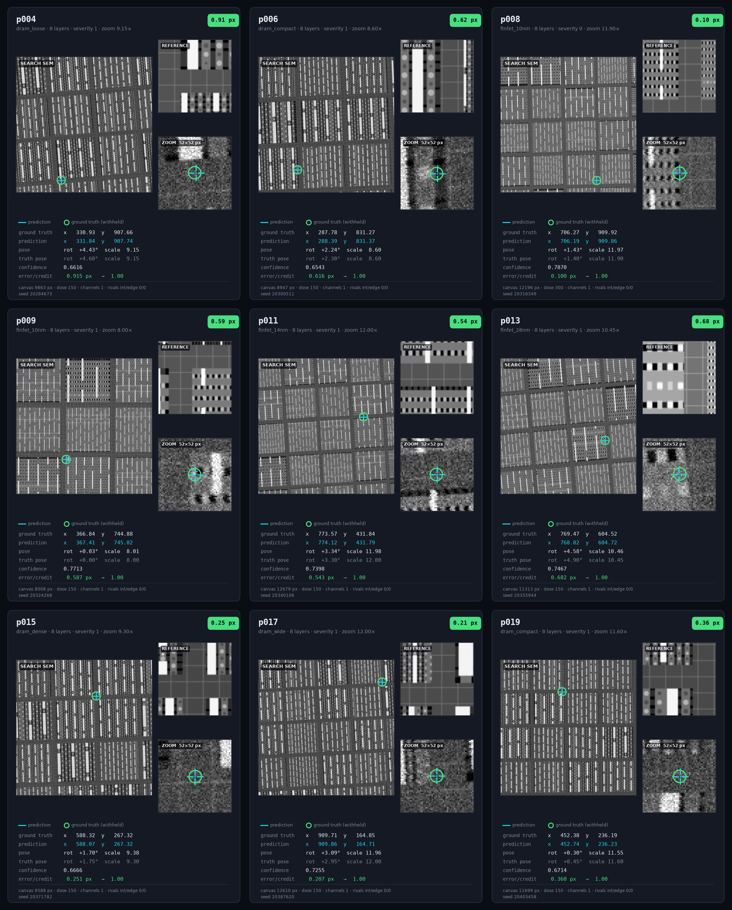

# LatticeRank Drift-Sense

CPU-only registration for the SEMICON India Phase 2 and Phase 3 tasks. Each
Phase 2 and Phase 3 judge submissions are self-contained in their own folders;
Phase 1 is retained separately as the foundation and task context.

| Task | Judge entry point | Input |
|---|---|---|
| [Phase 1: foundation](phase_1/README.md) | Context only; Phase 2 is its pose-aware successor | reference and search images |
| [Phase 2: SEM → SEM](phase_2/README.md) | `python phase_2/register.py --input pairs.csv --output predictions.csv` | SEM reference and SEM search |
| [Phase 3: CAD → SEM](phase_3/README.md) | `python phase_3/phase3.py --input pairs.csv --output predictions.csv` | reference GDS, search SEM, optional search GDS |

## Install

Python 3.11 or newer is required.

```bash
python -m pip install -r phase_2/requirements.txt
python -m pip install -r phase_3/requirements.txt
```

Inference is offline. Native numerical libraries default to one CPU thread for
predictable execution on shared and low-specification machines.

## Common output contract

Both phases write exactly:

```csv
pair_id,x,y,theta,scale,found,score
```

Each unique input ID produces one finite row. `found` is `0` or `1`, `score`
is clipped to `[0,1]`, and rejected rows use `x=y=theta=scale=0`. Output is
written atomically, and a malformed pair does not terminate the batch.

## Technical distinction

Phase 1 establishes the normalized image-correlation problem and the meaning of
location, presence and confidence. It is retained separately as context; the
current submission commands are the organizer-requested Phase 2 and Phase 3
entry points.

Phase 2 combines local SIFT/RANSAC evidence, global directional-spectrum
proposals, explicit scale-boundary hypotheses and spatial edge correlation.
It retains remote lattice aliases, refines candidates continuously in
`(x,y,theta,scale)`, and constructs confidence from independent evidence rather
than copying the winning correlation value.

Phase 3 keeps GDS layers separate and estimates how each visible layer appears
in the SEM at every candidate. A layer may fit to zero, so a faint first or
last layer does not invalidate the template. Search-side CAD can add exact
geometry proposals, but SEM evidence still decides presence.

These choices address the two central ambiguities in the supplied data:
repeated semiconductor lattices create convincing remote aliases, and CAD
layer identity does not determine SEM brightness.

## Visual evidence

### Cumulative GDS layer tiles


### CAD → inferred layer appearance → SEM


### Phase 2 organizer coverage


Green cards are present references; red cards are true no-match cases. The
bold band exposes scale, rotation and severity before the detailed acquisition
and uniqueness measurements.

### Phase 3 distortion coverage


The bold band exposes the principal geometric and dose settings; the rows
below it retain the remaining acquisition, noise, fabrication and layout
parameters.

### Phase 2 prediction tiles



Each card uses the search SEM as the main image, places the reference tile in
the upper-right, overlays our prediction as a cyan cross and ground truth as a
green ring, and prints parameters, pose, confidence, error and processing path
underneath. The Phase 2 README contains all four dataset groups.

### Phase 3 prediction tiles


Every grid tile is generated from the supplied organizer data or generator and
prints the parameters needed to inspect that case. Only the rendered figures
are included; organizer datasets, ground truth and generators are not shipped.

## Measured validation

- Phase 2 organizer 25-pair cut: `20 TP / 0 FP / 0 FN`, F1 `1.000`; measured
  `81.3/85` before efficiency and generator-analysis points -- localization
  `38.80/40`, scale `9.20/10`, rotation `8.90/10`, rejection `15.00/15`,
  calibration `9.40/10`.
- The organizer's own ZNCC baseline on that identical cut reaches mean
  localization credit `0.710` and rejection F1 `0.833`, with a *negative*
  peak-separation gap. This submission reaches `0.970` and `1.000`.
- Phase 3 organizer 25-pair CAD/SEM cut: `23 TP / 0 FP / 0 FN / 2 TN`, F1
  `1.000`; measured `84.78/85` with localization `40.00/40` -- every accepted
  site lands inside 1 px, worst case `0.68 px`.
- Phase 2 independent certified stress sets: `30/0/0` and `30/2/0`
  `(TP/FP/FN)`, holding `76-78/85` across harder distributions.
- Regression suites ship with each phase and run independently:
  `phase_2` `39 passed`, `phase_3` `17 passed`.

Reproduce the suites from inside either phase folder:

```bash
python -m pytest tests -q
```

These are corpus measurements, not claims about an unseen jury set. A repeated
layout can be genuinely indistinguishable when the available crop has no unique
structure; the solvers expose that ambiguity through `score` and may abstain.

## Repository map

```text
phase_1/          foundational task context
phase_2/          self-contained SEM-to-SEM submission
phase_3/          self-contained CAD-to-SEM submission
```

## Verify

```bash
python phase_2/register.py --help
python phase_3/phase3.py --help
```
