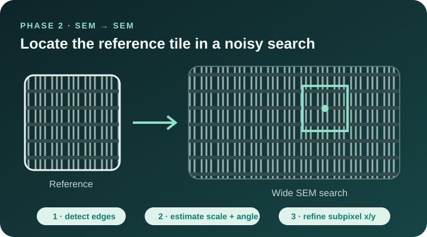
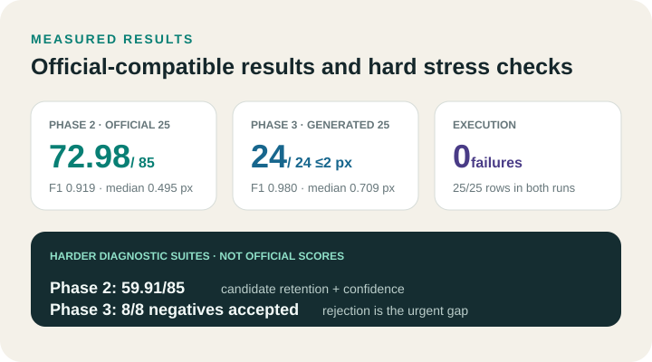
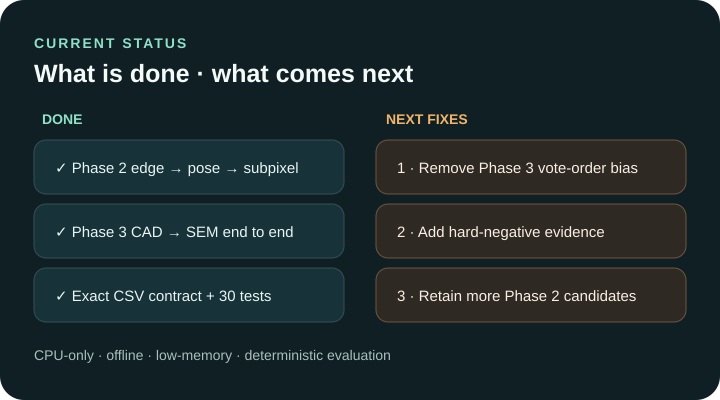

# LatticeRank Drift-Sense

CPU-only edge registration for the SEMICON India hackathon.

## Project view

| GDS layer tiles | Merged CAD → yield → SEM |
|---|---|
|  |  |
| **Phase 2: SEM → SEM** | **Measured results** |
|  |  |
| **Completed and next** | |
|  | |

The organizer's **tiles** are cumulative GDS layer views: layers 0–1,
layers 0–3, layers 0–5, and finally all eight layers. The **merged view** is
the complete stack of colored polygons. It has exact geometry and no image
brightness or SEM noise. The solver then infers a grayscale layer appearance
and registers that geometry against the supplied noisy SEM search. The two
Phase 3 images above were generated from the supplied organizer generator,
not copied from the photographed slides.

- **Done:** edge detection, scale/rotation proposal, multi-peak translation,
  continuous subpixel refinement, confidence, no-match output, Phase 3
  layer-aware CAD matching, and exact judge CSV handling.
- **Validation:** Phase 2 returned 20 TP, 0 FP, and 0 FN on the supplied
  25-pair cut. Two independently seeded, post-degradation-certified hard
  suites returned 30/0/0 and 30/2/0 (TP/FP/FN). Phase 3 returned 24/0/0 on
  both the official image-only set and the frozen 32-pair CAD/SEM suite; the
  latter localized all 24 positives at the exact labelled centre.
- **Confidence:** Phase 2 standardizes each correlation peak against its own
  sidelobes (presence AUC `0.940` on the 25-pair cut). Phase 3 additionally
  measures the CAD-layer/SEM correlation ratio and held-out yield fit.
- **Known limit:** repeated lattice cells can be genuinely indistinguishable.
  Stress labels are therefore certified after every degradation: positives
  must remain uniquely observable and accidental negative matches are removed.
  On the second Phase 2 hard seed, two independently generated decoys remain
  false accepts; no corpus-specific rejection rule is used to hide them.

Detailed measurements and algorithms are in
[FINDINGS_AND_PROCESS.md](FINDINGS_AND_PROCESS.md).

## Install

```bash
python -m pip install -r requirements.txt
```

Python 3.11 or newer is required. Inference is offline and defaults to one CPU
thread.

## Phase 2: SEM to SEM

```bash
python register.py --input pairs.csv --output predictions.csv
```

Required input fields: `pair_id`, `reference_path`, `search_path`.
Rotation is reported in degrees and scale is reported in the range 8–12.

## Phase 3: CAD to SEM

```bash
python phase3.py --input pairs.csv --output predictions.csv
```

Required input fields: `pair_id`, `search_path`, `reference_gds_path`.
`search_gds_path` is used when supplied. `reference_sem_path` and
`params_json_path` are training metadata and are never read during inference.
Phase 3 reports fixed `theta=0` and `scale=10`, while fitting visible GDS layers
against the SEM image; the first or last layer may be faint or absent.

## Output

Both entry points write exactly:

```csv
pair_id,x,y,theta,scale,found,score
```

Each unique input ID receives one finite output row. `found` is 0 or 1;
rejected rows have `x=y=theta=scale=0`; `score` is in `[0,1]`.

Run the focused checks with `python -m pytest -q`.

## Reproducible hard-case validation

Generate and score a deterministic Phase 2 stress suite:

```bash
python tools/hard_cases.py generate --output hard40 --count 40 --absent 10 --seed 20260918
python register.py --input hard40/pairs.csv --output hard40/predictions.csv
python tools/hard_cases.py score --truth hard40/ground_truth.csv \
  --predictions hard40/predictions.csv --output hard40/score.json \
  --failures hard40/failures.csv
```

`manifest.csv` records final-image intensity and structural uniqueness checks.
Phase 3 corpora can be audited after degradation with:

```bash
python tools/phase3_certify.py --pairs pairs.csv --truth ground_truth.csv \
  --output certification.json
```
