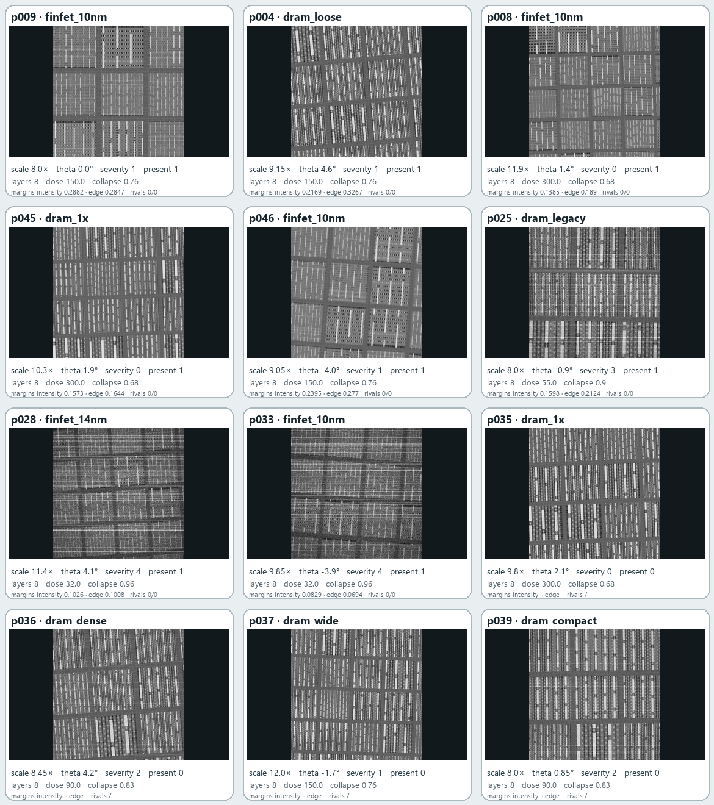
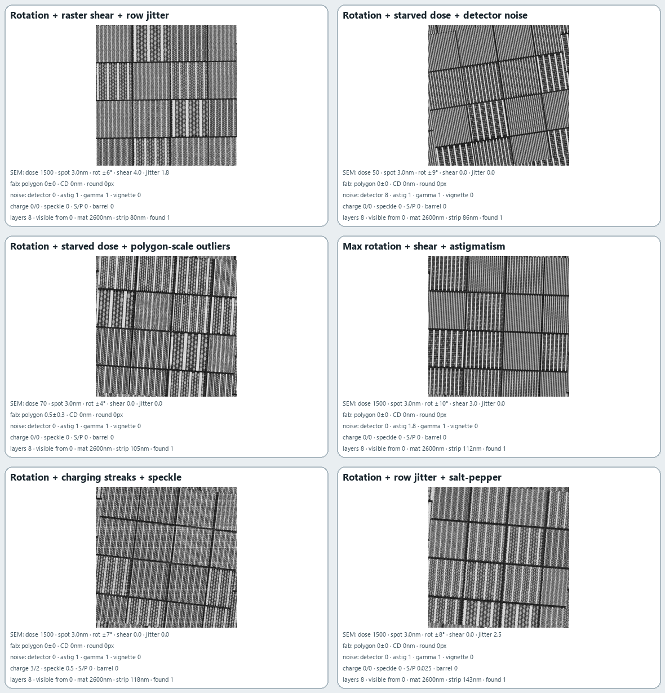

# LatticeRank Drift-Sense

CPU-only registration for the SEMICON India Phase 2 and Phase 3 tasks. The
repository exposes each phase separately while retaining the original root
entry points for judge compatibility.

| Task | Judge entry point | Input |
|---|---|---|
| [Phase 2: SEM → SEM](phase_2/README.md) | `python phase_2/register.py --input pairs.csv --output predictions.csv` | SEM reference and SEM search |
| [Phase 3: CAD → SEM](phase_3/README.md) | `python phase_3/phase3.py --input pairs.csv --output predictions.csv` | reference GDS, search SEM, optional search GDS |

The equivalent root commands remain available:

```bash
python register.py --input pairs.csv --output predictions.csv
python phase3.py --input pairs.csv --output predictions.csv
```

## Install

Python 3.11 or newer is required.

```bash
python -m pip install -r requirements.txt
```

Inference is offline. Native numerical libraries default to one CPU thread for
predictable execution on shared and low-specification machines.

## Common output contract

Both phases write exactly:

```csv
pair_id,x,y,theta,scale,found,score
```

Each unique input ID produces one finite row. `found` is `0` or `1`, `score`
is clipped to `[0,1]`, and rejected rows use `x=y=theta=scale=0`. Output is
written atomically, and a malformed pair does not terminate the batch.

## Technical distinction

Phase 2 combines local SIFT/RANSAC evidence, global directional-spectrum
proposals, explicit scale-boundary hypotheses and spatial edge correlation.
It retains remote lattice aliases, refines candidates continuously in
`(x,y,theta,scale)`, and constructs confidence from independent evidence rather
than copying the winning correlation value.

Phase 3 keeps GDS layers separate and estimates how each visible layer appears
in the SEM at every candidate. A layer may fit to zero, so a faint first or
last layer does not invalidate the template. Search-side CAD can add exact
geometry proposals, but SEM evidence still decides presence.

These choices address the two central ambiguities in the supplied data:
repeated semiconductor lattices create convincing remote aliases, and CAD
layer identity does not determine SEM brightness.

## Visual evidence

| Cumulative GDS layer tiles | CAD → inferred layer appearance → SEM |
|---|---|
|  |  |
| Phase 2 parameter grid | Phase 3 distortion grid |
|  |  |

Every grid tile is generated from the supplied organizer data or generator and
prints the parameters needed to inspect that case. Only the rendered figures
are included; organizer datasets, ground truth and generators are not shipped.

## Measured validation

- Phase 2 organizer 25-pair cut: `20 TP / 0 FP / 0 FN`; measured score
  `81.3/85` before efficiency and generator-analysis points.
- Phase 2 independent certified stress sets: `30/0/0` and `30/2/0`
  `(TP/FP/FN)`.
- Phase 3 organizer-compatible image-only set: `24 TP / 0 FP / 0 FN / 1 TN`,
  all accepted positives within 2 px.
- Phase 3 frozen 32-pair CAD/SEM set: `24 TP / 0 FP / 0 FN / 8 TN`, all
  positives at the labelled centre.
- Submitted-head regression suite: `59 passed`, including both judge-facing
  phase-folder entry points.

These are corpus measurements, not claims about an unseen jury set. A repeated
layout can be genuinely indistinguishable when the available crop has no unique
structure; the solvers expose that ambiguity through `score` and may abstain.

## Repository map

```text
phase_2/          Phase 2 entry point and technical notes
phase_3/          Phase 3 entry point and technical notes
driftforge/       Shared registration implementation
assets/           Pipeline and parameter-sweep figures
tests/            Contract and algorithm regression tests
register.py       Root Phase 2 compatibility entry point
phase3.py         Root Phase 3 compatibility entry point
```

## Verify

```bash
python -m pytest -q
python phase_2/register.py --help
python phase_3/phase3.py --help
```
