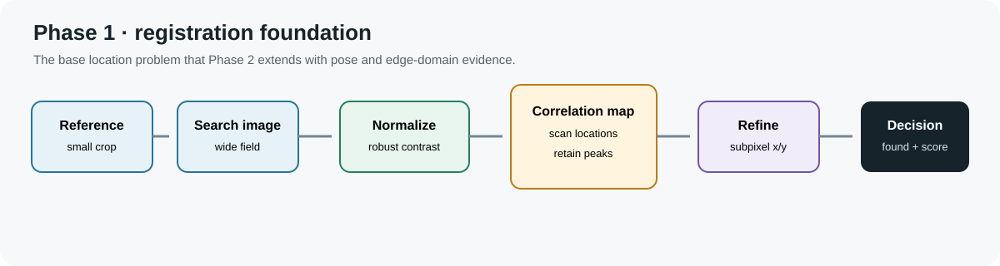

# Phase 1 — Registration foundation

Phase 1 is kept as a separate problem-context section. The current judge
submission requests executable entry points for Phase 2 and Phase 3; this
folder therefore does not introduce another command or duplicate the Phase 2
implementation.

## Task foundation

Phase 1 establishes the base image-registration contract:

1. load a reference crop and a larger search image;
2. normalize their usable contrast;
3. compare the reference over candidate search locations;
4. find and refine the strongest response;
5. compare it with remote alternatives;
6. report location, presence and confidence.

The central limitation is that intensity alone is fragile under changing dose,
layer brightness, noise and acquisition conditions. Repeated semiconductor
patterns also create multiple similar peaks. Phase 2 directly addresses these
limits with edge-domain pose proposals, alias retention, four-dimensional
refinement and a separate acceptance decision.

## Relationship to the submitted phases

- [Phase 2](../phase_2/README.md) is the pose-aware SEM-to-SEM implementation.
- [Phase 3](../phase_3/README.md) transfers the registration task to layered
  CAD-to-SEM geometry with unknown per-layer appearance.
