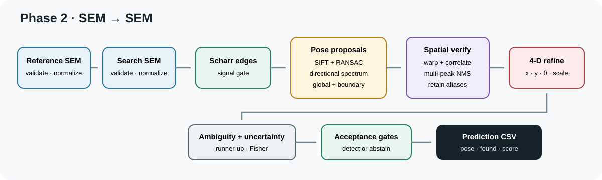
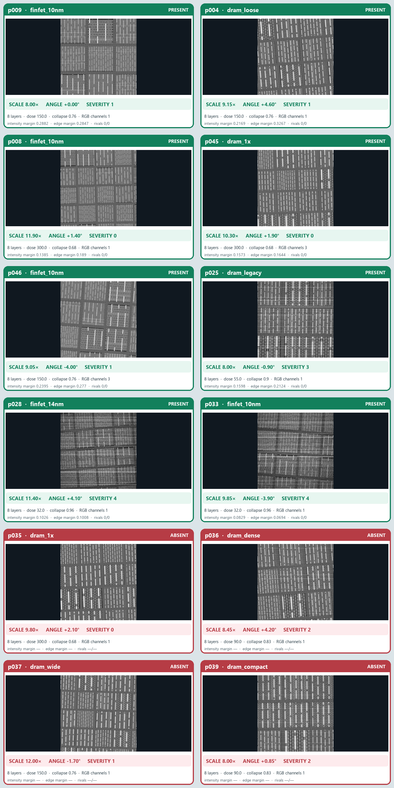

# Phase 2 — SEM to SEM

## Run

Install this phase only:

```bash
python -m pip install -r phase_2/requirements.txt
```

Run from the repository root:

```bash
python phase_2/register.py --input pairs.csv --output predictions.csv
```

The equivalent command from inside `phase_2/` is:

```bash
python register.py --input pairs.csv --output predictions.csv
```

Required input:

```csv
pair_id,search_path,reference_path
```

Relative paths are resolved from the directory containing `pairs.csv`.



## Inference path

1. Validate each image and convert it to a finite grayscale array.
2. Measure robust contrast and Scharr gradient energy; reject images without
   usable structural signal.
3. Gaussian-smooth the images and compute normalized Scharr edge magnitude.
4. Generate complementary pose hypotheses from:
   - SIFT descriptors, ratio filtering and affine RANSAC;
   - directional spectra for global rotation and scale;
   - coarse global edge searches;
   - boundary/intensity rescue proposals for degraded edge maps;
   - explicit hypotheses at the 8× and 12× scale limits.
5. Deduplicate hypotheses while preserving candidates from distinct sources.
6. Warp the reference edge map for each retained scale and angle.
7. Correlate each template over the search image and retain several
   non-max-suppressed peaks, including remote lattice aliases.
8. Refine selected candidates continuously in `(x,y,theta,scale)`.
9. Compare the winner with a spatially remote runner-up.
10. Verify it using edge correlation, peak separation, pose support, intensity
    agreement and polarity-insensitive gradient orientation.
11. Estimate residual/Fisher translation uncertainty and build a bounded
    confidence score.
12. Apply the abstention gates and write the required CSV row.

## What is different

- Location is driven primarily by edges, reducing sensitivity to dose and
  layer-brightness changes.
- Local and global pose estimators complement each other: RANSAC handles
  distinctive keypoints while the spectral route covers dense patterns.
- Remote aliases remain visible to the decision rule instead of being erased
  after the first maximum.
- Position, angle and scale are refined together instead of reported from a
  coarse grid.
- A high correlation alone cannot automatically accept an absent reference.

## Eyeball grid



The grid is a coverage view of organizer cases. It is documentation only and
is never read during inference.

## Output

```csv
pair_id,x,y,theta,scale,found,score
```

`theta` is in degrees and `scale` is restricted to 8–12. Rejected pairs have
zero pose values.
