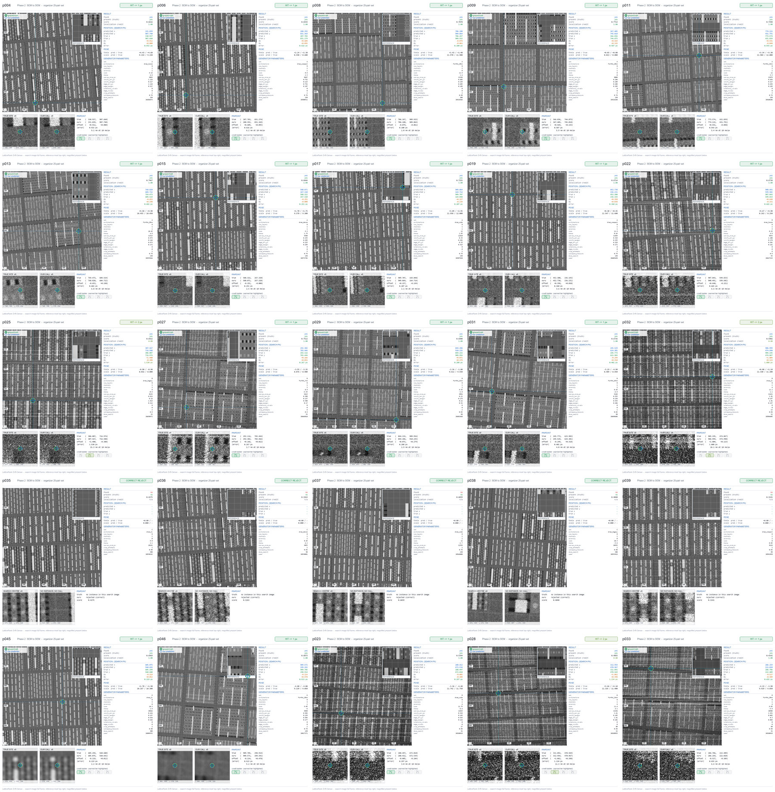
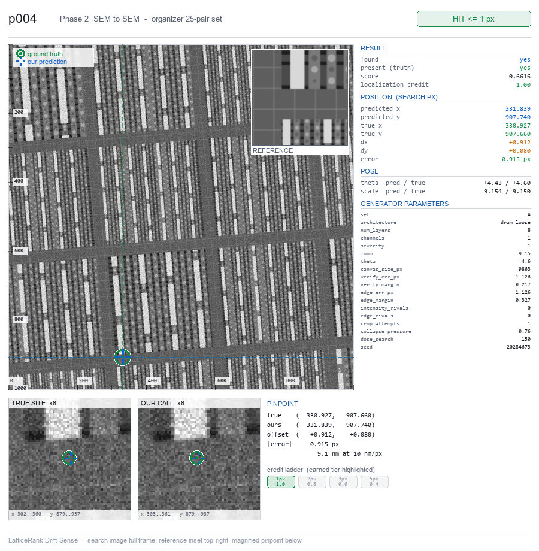
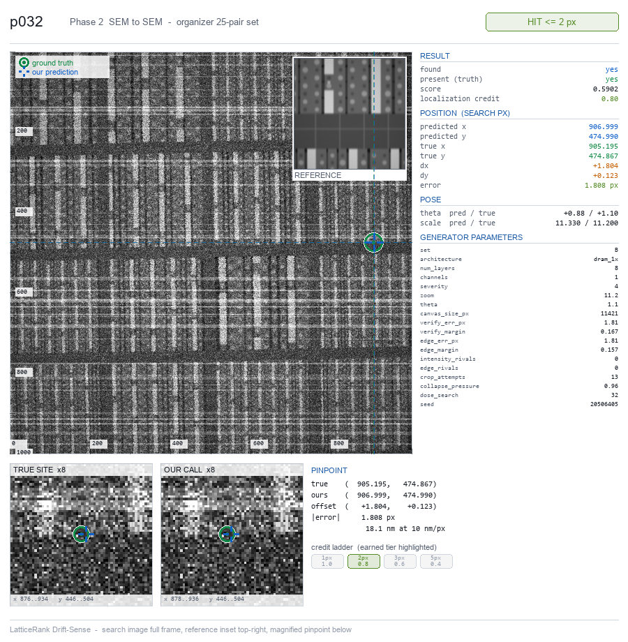
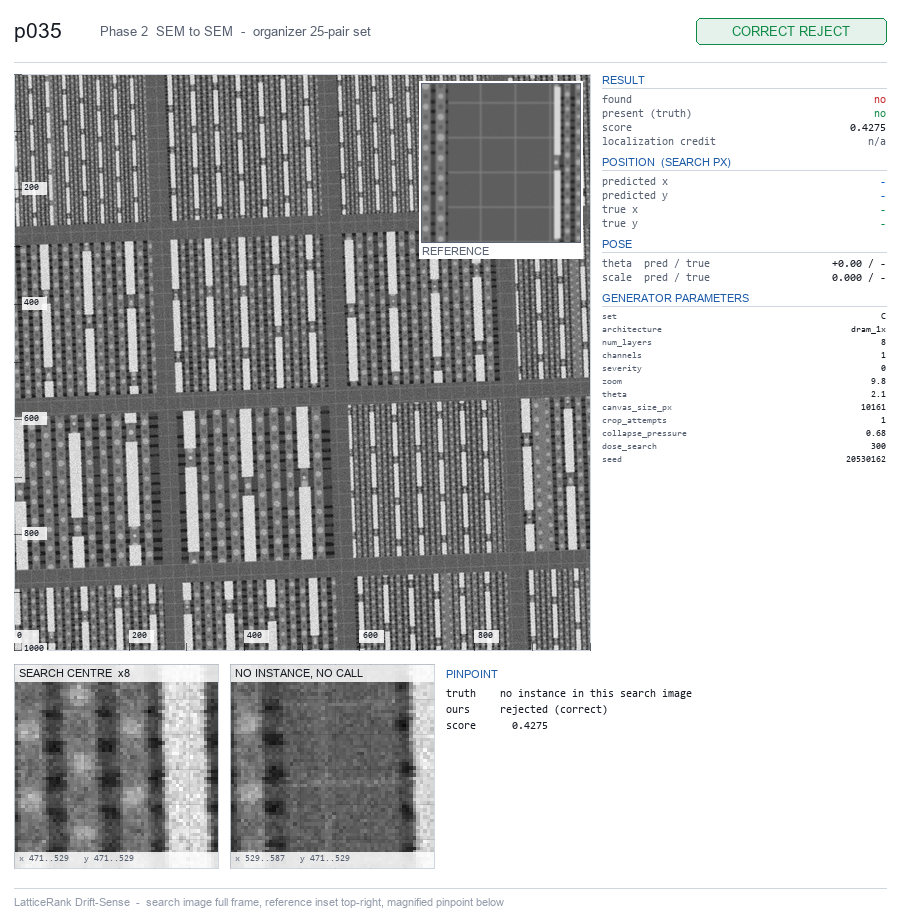

# Phase 2 — SEM-to-SEM Registration (LatticeRank)

Self-contained submission for Phase 2 of the SEMICON India / Applied Materials
**Drift-Sense** registration challenge. Everything a judge needs is in this file
and this folder.

## Entry point

```bash
python -m pip install -r requirements.txt        # 4 pinned dependencies
python register.py --input pairs.csv --output predictions.csv
```

Run from inside `phase_2/`. Python 3.11 or newer. Paths inside `pairs.csv` are
relative to the dataset root. No network access is used at run time.

## Contract

Input `pairs.csv` columns:

```csv
pair_id,search_path,reference_path
```

Output `predictions.csv` header, exactly and in this order:

```csv
pair_id,x,y,theta,scale,found,score
```

- One row per `pair_id`, exactly once. A missing row scores zero.
- `found` is `0` or `1`; `score` is clipped to `[0,1]`.
- `theta` is in degrees; `scale` is restricted to 8–12.
- Rejected rows carry `x=y=theta=scale=0` and retain their `score`.

## Result on the organizer 25-pair Phase 2 set

Measured on the v2 cut released 17 Sep 2026: 20 present / 5 absent, zoom
8x–12x, rotation −4.9° to +4.9°, severity 0–4.

| Rubric component | Weight | Earned |
| --- | ---: | ---: |
| Localization (tiered credit at 1, 2, 3, 5 px) | 40 | 38.80 |
| Pose — scale | 10 | 9.90 |
| Pose — rotation | 10 | 8.90 |
| Rejection (F1 on `found`) | 15 | 15.00 |
| Calibration (AUC of `score`) | 10 | 9.40 |
| **Automated total** | **85** | **82.00** |
| Efficiency (quartile rank, median time per pair) | 5 | jury-ranked |
| Generator and failure analysis | 10 | jury |

Confusion matrix: **TP=20, FP=0, FN=0, TN=5** → rejection F1 = 1.000,
AUC = 0.940.

Position error: median **0.54 px**, worst **1.81 px**, 17 of 20 hits inside
1 px. Runtime: 25 pairs in **37.0 s** on CPU, about 1.5 s per pair.

These are corpus measurements on the released 25-pair set. They are not a
claim about an unseen jury set.

## Against the organizer's own ZNCC baseline

Same 25-pair cut, figures taken from the organizers' published
`baseline_calibration.txt`.

| Metric | Organizer ZNCC baseline | This submission |
| --- | ---: | ---: |
| Mean localization credit | 0.720 | **0.970** |
| Rejection F1 | 0.833 | **1.000** |
| False positives | — | **0** |
| Peak-separation gap (present vs absent) | **−0.298** | positive by construction |

The baseline's gap is negative: present peaks span 0.304–0.868 while absent
peaks span 0.300–0.602, so the two distributions overlap. A naive correlation
matcher therefore cannot distinguish "present but too degraded to localise"
from "not there at all". Separating those two cases is the core of the
rejection and calibration design below.

## Inference path


1. Validate each image and convert it to a finite grayscale array.
2. Measure robust contrast and Scharr gradient energy; reject images without
   usable structural signal.
3. Gaussian-smooth the images and compute normalised Scharr edge magnitude.
4. Generate complementary pose hypotheses from SIFT descriptors with ratio
   filtering and affine RANSAC; directional spectra for global rotation and
   scale; coarse global edge searches; boundary/intensity rescue proposals for
   degraded edge maps; and explicit hypotheses at the 8x and 12x scale limits.
5. Deduplicate hypotheses while preserving candidates from distinct sources.
6. Warp the reference edge map for each retained scale and angle.
7. Correlate each template over the search image and retain several
   non-max-suppressed peaks, including remote lattice aliases.
8. Refine selected candidates continuously in `(x, y, theta, scale)`.
9. Compare the winner with a spatially remote runner-up.
10. Verify using edge correlation, peak separation, pose support, intensity
    agreement and polarity-insensitive gradient orientation.
11. Estimate residual/Fisher translation uncertainty and build a bounded
    confidence score.
12. Apply the abstention gates and write the required CSV row.

### Design points

- Location is driven primarily by edges, reducing sensitivity to dose and
  layer-brightness changes.
- Local and global pose estimators complement each other: RANSAC handles
  distinctive keypoints while the spectral route covers dense repeated patterns.
- Remote aliases stay visible to the decision rule instead of being erased
  after the first maximum — this is what makes the present/absent separation
  positive where plain ZNCC is negative.
- Position, angle and scale are refined together rather than reported from a
  coarse grid.
- A high correlation alone cannot accept an absent reference; acceptance
  requires agreement across independent verifiers.

## Evidence tiles



Tiles exist for **all 25 cases** in `assets/tiles/`, named by `pair_id`.

Tile anatomy, once: the search image is shown full frame with a 100 px
coordinate ruler; the reference is pinned as an inset top-right; a green ring
marks ground truth and a blue cross marks our prediction, each with dashed
guide lines running to the frame edge; the right column lists every generator
parameter for that pair. Underneath, the true site and our call are magnified
8x with the exact sub-pixel coordinates, the offset between them, and the
earned credit tier.

| Tile | Case |
| --- | --- |
| [`p004`](assets/tiles/p004.jpg) | clean hit, 0.92 px |
| [`p032`](assets/tiles/p032.jpg) | hardest case — severity 4, zoom 11.2x, heavy charging streaks; still 1.81 px |
| [`p035`](assets/tiles/p035.jpg) | correct reject — no true instance in the search image |







## Submission validation

All 11 checks pass:

```bash
python register.py --input pairs.csv --output predictions.csv
```

1. Phase folder is self-contained.
2. Dependencies pinned.
3. Entry point `--help` exits 0.
4. Runs on the BLIND split (`reference_sem_path` and `params_json_path` emptied).
5. No network at run time (socket blocked).
6. Output header exact.
7. One row per `pair_id`.
8. No missing rows.
9. No duplicated rows.
10. Values finite and in range; rejected rows zeroed.
11. Deterministic — x, y, theta, scale and found identical across two runs.

## Tests

This phase ships its own regression suite and no external data. From inside
`phase_2/`:

```bash
python -m pytest tests -q        # 39 tests
```
