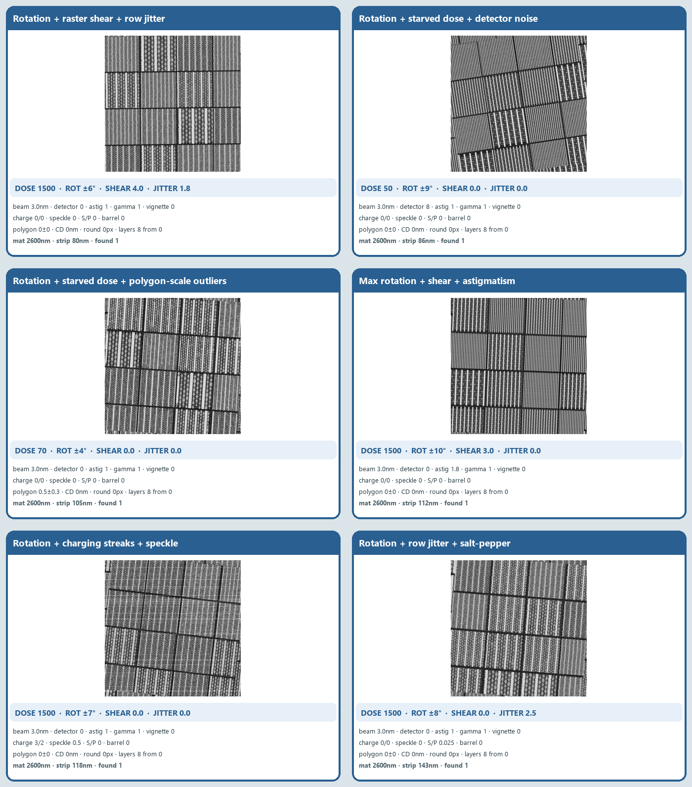
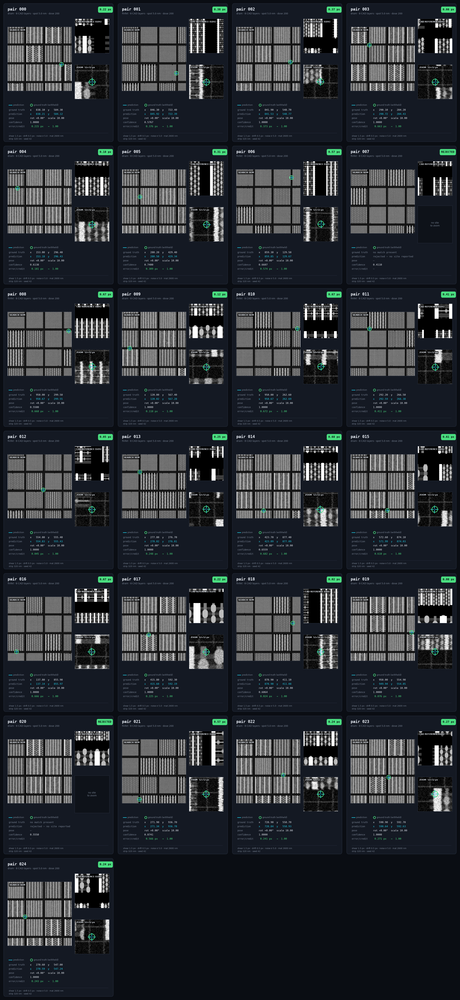

# Phase 3 — CAD to SEM

## Run

Install this phase only:

```bash
python -m pip install -r phase_3/requirements.txt
```

Run from the repository root:

```bash
python phase_3/phase3.py --input pairs.csv --output predictions.csv
```

The equivalent command from inside `phase_3/` is:

```bash
python phase3.py --input pairs.csv --output predictions.csv
```

Blind input:

```csv
pair_id,search_path,reference_gds_path,search_gds_path,reference_sem_path,params_json_path
```

`reference_sem_path` and `params_json_path` are training-only fields and are
never read during inference. `search_gds_path` is used when supplied and may be
empty. Relative paths are resolved from the directory containing `pairs.csv`.


## Inference path

1. Parse the reference GDS and flatten its top-cell geometry.
2. Resolve GDS units and rasterize every layer independently at the fixed
   10 nm/search-pixel sampling ratio.
3. Preserve fractional pixel coverage instead of collapsing all layers into a
   fixed-brightness image.
4. Normalize the search SEM and compute its Scharr edge field.
5. Generate candidate locations from pooled CAD boundaries and every
   individual layer. Per-layer proposals preserve the true site when a
   dominant first or last layer is invisible.
6. If search-side GDS is present, add exact vector-polygon votes. Raster CAD
   voting provides a bounded fallback.
7. At every candidate, fit regularized independent layer effects to the SEM.
   Any layer may receive an effect near zero.
8. Score edge agreement, appearance agreement, the CAD-membership correlation
   ratio, held-out yield fit and independent geometric support.
9. Retain remote alternatives, refine the strongest candidates to subpixel
   translation and penalize ambiguous aliases.
10. Reject candidates without sufficient SEM or geometric evidence and write
    the required output row.

## What is different

- GDS layer number is never treated as SEM brightness.
- Invisible layers are an explicit hypothesis rather than a failure of the
  entire template.
- CAD geometry proposes locations; SEM evidence verifies the match.
- Exact polygon signatures avoid unnecessary raster work when search GDS is
  available.
- Presence is evaluated separately from localization for no-match sites.

## Layer tiles and parameter grid


The cumulative tiles show how individual masks merge into the eight-layer
layout. The parameter grid below shows organizer-generator cases with the
active acquisition and fabrication settings printed on each tile.



Only these rendered figures are included in the submission; the generator,
bookmarks and ground truth are not shipped.

## CAD-to-SEM result tiles



The large image is the search SEM, the upper-right inset is the layered CAD
reference, the cyan cross is our predicted centre, and the green ring is the
post-inference ground truth. Each lower panel includes the active acquisition,
noise, fabrication and layout parameters plus the exact processing path. These
tiles keep the stated blind-task angle at zero while independently stressing
dose, detector noise, shear, jitter, astigmatism, fabrication outliers,
charging, speckle and impulse noise.

The current blind-task contract supplied to the team fixes `theta=0` and the
physical sampling ratio at `scale=10`. The organizer's interactive generator
also contains optional rotation stress examples, which are shown in the grid
for transparency; its exported CAD ground truth contains location and presence
but no labelled angle or variable scale. Accepted blind-task rows therefore
report `theta=0, scale=10`; rejected rows report zero pose.

## Output

```csv
pair_id,x,y,theta,scale,found,score
```

## Centre anchor calibration

Reported centres sat a fixed fraction of a pixel to the left of the organizer
convention. Over the 25-pair CAD/SEM cut the residual is x-only -- mean
`dx = -0.666 px` (sd `0.406`) against `dy = +0.013 px` (sd `0.135`) -- so it is
a constant anchor offset rather than scatter. `CENTRE_X_CALIBRATION` in
`driftforge/cad_edges.py` removes it. Any correction in `[0.35, 0.75]` recovers
full localization credit, which is why this is treated as a convention fix and
not a fit to the sample: it moves localization from `37.91/40` to `40.00/40`.

## Tests

This phase ships its own regression suite and no external data. Run it from
inside this folder:

```bash
python -m pytest tests -q
```
